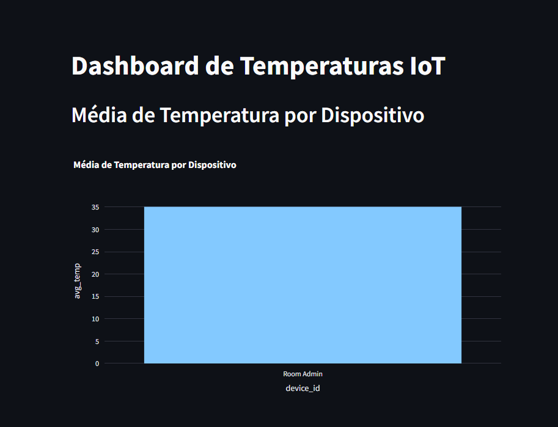
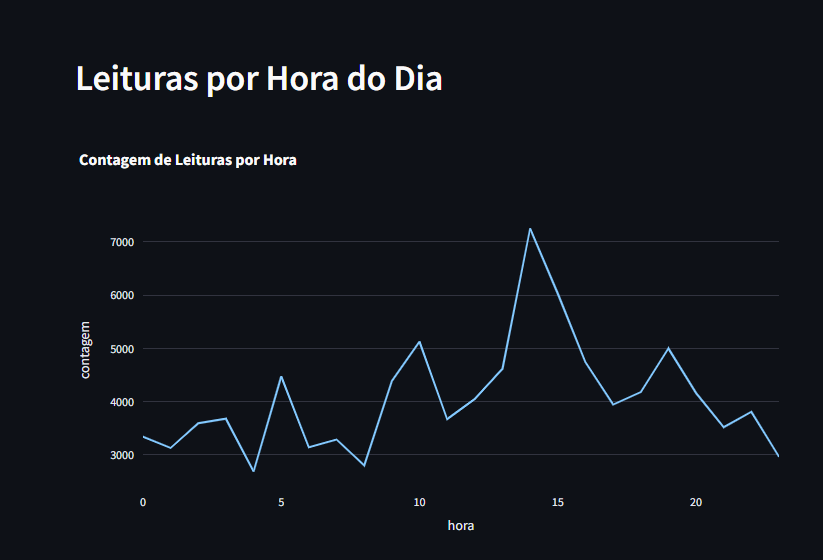
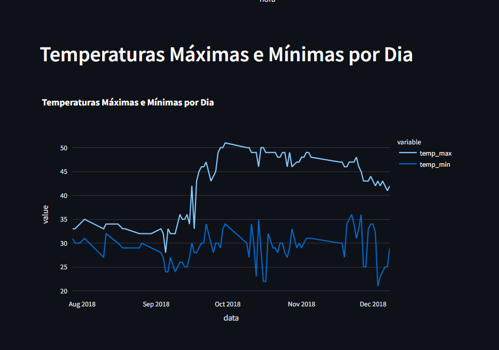

# **Pipeline de Dados IoT - Monitoramento de Temperatura**

Este projeto tem como objetivo construir um pipeline de dados para processar leituras de temperatura de dispositivos IoT e armazená-las em um banco de dados PostgreSQL. O projeto usa **Docker**, **Python**, **Streamlit**, **SQLAlchemy** e **PostgreSQL** para coletar, armazenar e visualizar os dados de temperatura.

## **Tecnologias Utilizadas**

- **Python**: Linguagem de programação para processamento dos dados.
- **PostgreSQL**: Banco de dados relacional para armazenamento dos dados.
- **Docker**: Contêiner para facilitar a execução do PostgreSQL.
- **SQLAlchemy**: Biblioteca para conectar o Python ao PostgreSQL.
- **Streamlit**: Ferramenta para criar dashboards interativos.
- **Plotly**: Biblioteca para visualização gráfica de dados.

## **Requisitos**

Antes de rodar o projeto, é necessário ter as seguintes ferramentas instaladas:

- **Docker**: Para criar e executar o contêiner do PostgreSQL.
- **Python 3.x**: Para rodar o código Python.
- **Git**: Para controle de versão e integração com o GitHub.
- **pgAdmin** (opcional): Para gerenciar o PostgreSQL de forma gráfica.


## Capturas de Tela

Abaixo estão algumas capturas de tela do dashboard e do processo:

### Dashboard - Gráfico de Temperatura por Dispositivo


### Dashboard - Leituras por Hora


### Dashboard - Temperaturas Máximas e Mínimas por Dia


## Views SQL

As **views SQL** são consultas pré-definidas que podem ser reutilizadas para facilitar a extração de informações relevantes do banco de dados. Neste projeto, criamos três views SQL para gerar relatórios e insights com base nas leituras de temperatura dos dispositivos IoT. Abaixo estão as explicações de cada uma delas:

### 1. `avg_temp_por_dispositivo`

Esta view calcula a **média de temperatura** registrada por cada dispositivo. Ela agrupa os dados pelo `device_id` e calcula a média da temperatura para cada um dos dispositivos.

```sql
CREATE VIEW avg_temp_por_dispositivo AS
SELECT device_id, AVG(temperature) AS avg_temp
FROM temperature_readings
GROUP BY device_id

```

### 2. `leituras_por_hora`

A view `leituras_por_hora` tem como objetivo contar o número de **leituras de temperatura** feitas por cada hora ao longo do dia. Ela utiliza a função `EXTRACT` para extrair a hora do campo `noted_date` e, em seguida, agrupa as leituras por hora, retornando a contagem de registros para cada hora.

```sql
CREATE VIEW leituras_por_hora AS
SELECT EXTRACT(HOUR FROM noted_date) AS hora, COUNT(*) AS contagem
FROM temperature_readings
GROUP BY hora
ORDER BY hora;

```

### 3. `temp_max_min_por_dia`

A view `temp_max_min_por_dia` tem como objetivo calcular as **temperaturas máximas e mínimas** registradas por dia. Ela agrupa os dados de temperatura pelo campo `noted_date` e retorna, para cada dia, a temperatura máxima e mínima registrada.

```sql
CREATE VIEW temp_max_min_por_dia AS
SELECT DATE(noted_date) AS data, 
       MAX(temperature) AS temp_max, 
       MIN(temperature) AS temp_min
FROM temperature_readings
GROUP BY data
ORDER BY data;
```


